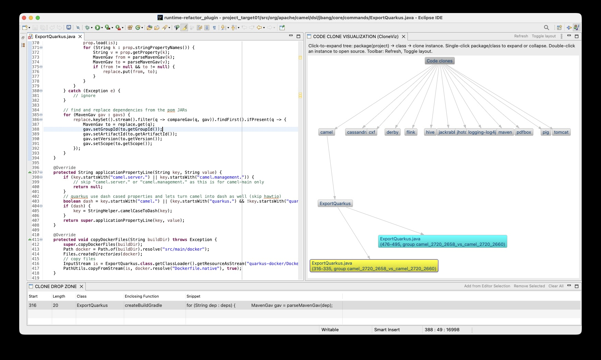

# Drag-to-Refactor README



## Overview

This prototype adds a drag-to-refactor workflow to the Eclipse plugin.

A user can:

1. Select a clone snippet in the Java editor by using the clone graph visualization (CloneViz).
2. Add that selection to the **Clone Drop Zone**.
3. Drag one row from the Drop Zone table back into a Java editor.
4. Trigger clone-aware **Extract Method** refactoring at the drop target.

The current implementation supports payload-based drag and drop, drop-location-aware method placement, and a table-based Drop Zone UI.

---

## Current UI

### Clone Drop Zone table columns

The Drop Zone now uses a table instead of a simple list.

Displayed columns:

* **Start**: start line of the selected clone snippet
* **Length**: number of lines in the snippet
* **Class**: Java class name
* **Enclosing Function**: enclosing method/function name
* **Snippet**: truncated one-line preview of the selected code

This makes the stored clone snippets easier to review before dragging them back into an editor.

---

## Main workflow

### 1. Add selection from editor to Drop Zone

When the user clicks **Add from Editor Selection**:

* the active Java editor is located
* the current `ITextSelection` is read
* the selection start/end lines are computed
* the current file path is resolved
* the matching `CloneRecord` is found
* the matching `CloneSource` is found
* a `CloneDragPayload` is built
* a table row is added to the Drop Zone with:

  * display metadata
  * original snippet text
  * saved drag payload

### 2. Drag from Drop Zone table

Each Drop Zone row supports drag and drop.

Two transfer types are advertised:

* **`DropzoneTransfer`**: custom payload transfer using serialized `CloneDragPayload`
* **`TextTransfer`**: raw snippet text fallback

### 3. Drop into Java editor

When dropped into a Java editor:

* the editor drop listener receives the payload
* the drop line is computed from the editor caret/selection position
* the payload is printed for debugging
* the target `ICompilationUnit` is resolved from `payload.getRelativePath()`
* a new extracted-method location is computed from the drop line
* `performExtraction(...)` is called with:

  * target compilation unit
  * extraction targets
  * resolved extracted-method location

---

## Key data structures

### `CloneRecord`

Represents one clone group loaded from the clone JSON.

Important fields:

* `classid`
* `sources`
* `updated_files`
* `extracted_method`

Nested classes were updated to implement `Serializable` so the drag payload can be transferred safely.

### `CloneDragPayload`

Carries clone-aware refactoring information during drag and drop.

Important fields:

* `record`
* `selectedSource`
* `relativePath`
* `extractionTargets`
* `extractedMethodLocation`

Note: `extractedMethodLocation` in the payload is now treated as an **initial hint only**.
The actual location is recomputed at drop time from `dropLine`.

### `ExtractionTarget`

Represents one extract-method target range.

Important fields:

* `startLine`
* `endLine`
* `methodName`
* `isPrimary`

`ExtractionTarget` was also updated to be serializable.

---

## Drop-location-aware extracted method placement

### Previous behavior

The extracted method location was inferred from the selection source when the payload was built.

Example:

* if the selection came from method `baz()`
* the old logic could produce something like `After baz()`

### New behavior

The extracted method location is recomputed at drop time using **`dropLine`**.

Rule:

* find the nearest method **above** `dropLine`
* place the extracted method **after that method**

Example:

```java
void baz() { /* selected clone */ }

void foo() { }

// dropLine here

void bar() { }
```

Resolved placement:

* `After foo()`

### Invalid drop rule

If `dropLine` is **inside a method body**, extraction is rejected.

Behavior:

* print a warning/debug message
* do not run extract-method refactoring

This prevents ambiguous or unsafe insertion points.

---

## Drag-and-drop transfer status

### Working now

The custom transfer pipeline is working end to end:

* payload created in `DropzoneView`
* payload stored in the table row
* payload sent through `DropzoneTransfer`
* payload deserialized in `EditorDropStartup`
* payload fields printed successfully at drop time

### Important fix

`DropzoneTransfer` was originally implemented only for raw snippet strings.

It was updated to serialize and deserialize `CloneDragPayload` using `ByteArrayTransfer`.

This required:

* `CloneDragPayload` to implement `Serializable`
* `ExtractionTarget` to implement `Serializable`
* `CloneRecord` nested classes to implement `Serializable`

---

## Current Drop Zone behavior

When a row is dragged from the Drop Zone and dropped into a Java editor, the plugin currently:

1. receives the `CloneDragPayload`
2. resolves the target compilation unit
3. computes the placement from `dropLine`
4. calls:

```java
refactorService.performExtraction(cu, extractionTargets, placement.extractedMethodLocation);
```

This means the actual extraction location is determined by the user’s drop position, not only by the original clone source.

---

## Current limitations / next improvements

### 1. Multi-file clone groups

`buildExtractionTargets(record)` currently builds targets from the record.

If a clone group spans multiple files, extraction targets may need to be filtered to the selected file before running refactoring.

### 2. Better user-facing warnings

Current invalid-drop behavior is mostly debug-print based.

A better UX would show a visible warning dialog when:

* the drop is inside a method
* the compilation unit cannot be resolved
* no valid insertion anchor exists above the drop line

### 3. Table polish

Potential UI improvements:

* sortable columns
* auto-resize snippet column
* tooltips showing full snippet text
* double-click row to jump to source
* remove multiple selected rows cleanly

### 4. Cleaner logging

Some debug output still prints both:

* payload-provided extracted method location
* drop-resolved extracted method location

The drop-resolved value should be treated as the authoritative one.

---

## Main classes involved

* `DropzoneView.java`

  * table UI
  * selection capture
  * payload creation
  * drag source setup

* `EditorDropStartup.java`

  * editor drop listener
  * drop payload handling
  * drop-line resolution
  * placement resolution
  * refactoring invocation

* `DropzoneTransfer.java`

  * custom SWT `ByteArrayTransfer`
  * payload serialization/deserialization

* `CloneRecord.java`

  * clone model loaded from JSON

* `CloneDragPayload.java`

  * DnD payload model

* `ExtractionTarget.java`

  * extraction target range model

* `ExtractMethodService.java`

  * compilation unit lookup
  * extract-method execution

---

## Summary

The drag-to-refactor prototype now supports:

* clone selection capture from the editor
* table-based Drop Zone display
* payload-preserving drag and drop
* editor drop handling with clone-aware context
* extracted method placement based on the actual drop location
* automatic extract-method invocation after a valid drop
