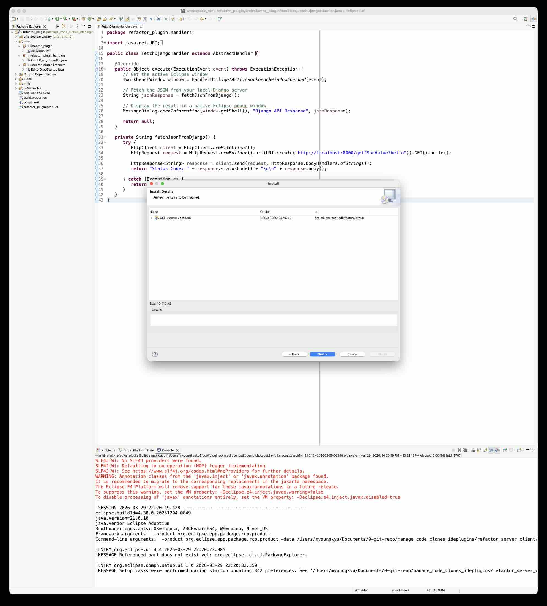
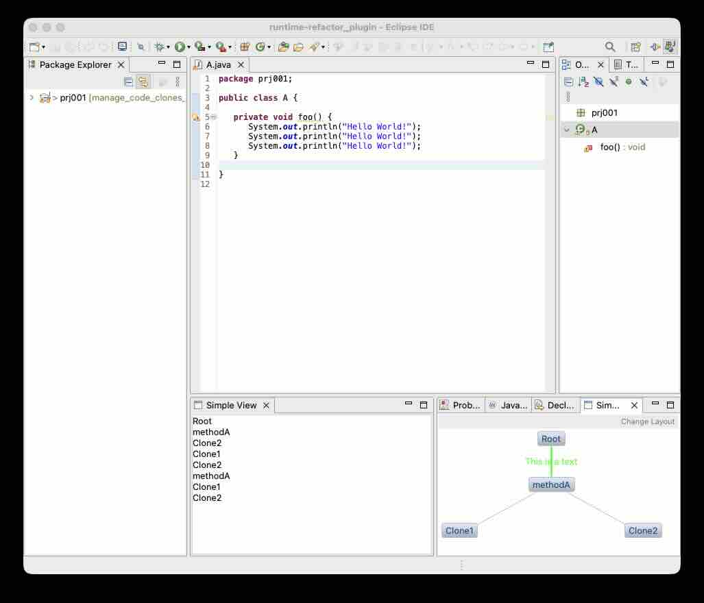

# Code Clone Visualizer (Eclipse Plugin)

This is an Eclipse plugin designed to help you visualize code structures and identify cloned code snippets using interactive graphs. 

This project uses **Eclipse 3 (e3)** architecture and the **GEF/Zest SDK** to draw nodes and connections directly inside your Eclipse IDE. 

## Prerequisites
Before running this project, ensure you have:
* **Eclipse IDE for RCP and RAP Developers** (or an Eclipse instance with Plugin Development Environment installed).
* **Java Development Kit (JDK)** installed and configured in Eclipse.

## Step 1: Install the GEF Zest SDK
Because this plugin relies on the Zest library to draw the graph nodes, you must install the Zest SDK into your Eclipse environment before running the code.

1. In Eclipse, go to **Help > Install New Software...** (or if you are importing the project, Eclipse may prompt you to install missing dependencies).
2. Select the Eclipse release update site (e.g., `2024-03 - https://download.eclipse.org/releases/2024-03`).
3. Search for **Zest** and check the box for **GEF Classic Zest SDK**.
4. Click **Next** and follow the prompts to complete the installation.

5. Once the installation is complete, Eclipse will ask you to restart. Click **Restart Now**.

## Step 2: Running the Plugin
Eclipse plugins are tested by launching a *second*, temporary instance of Eclipse (called the Runtime Workspace). 

1. Right-click on your `refactor_plugin` project folder in the **Package Explorer**.
2. Select **Run As > Eclipse Application**.
3. A new Eclipse window will open. This is your testing environment where the plugin is actively running!

## Step 3: Using the Views
Once your runtime Eclipse opens, you need to open our custom views to see the visualization in action.

1. Go to **Window > Show View > Other...**
2. Expand the **Zest Graph Views** folder.
3. Open both the **Simple View** and **Simple Zest View**.

### Features
* **Zest Graph:** Displays a visual hierarchy of your code (e.g., Root -> methodA -> Clones).
* **Interactive Selection:** Click on any node in the graph (like "Clone1"), and its name will automatically be appended to the "Simple View" text box on the left.
* **Layout Toggle:** Click the **Change Layout** button in the top-right corner of the Zest View to switch between Spring and Tree layouts.

## Project Structure Overview
If you want to explore the code, here are the key files to look at:
* `plugin.xml`: The heart of the plugin. It registers our views, menus, and commands with Eclipse.
* `view/SimpleZestView.java`: Contains the logic for building the visual graph, nodes, and connections.
* `view/SimpleView.java`: A basic text view that receives updates when graph nodes are clicked.
* `view/handlers/`: Contains the actions triggered by user clicks (like changing the graph layout or clearing text).

