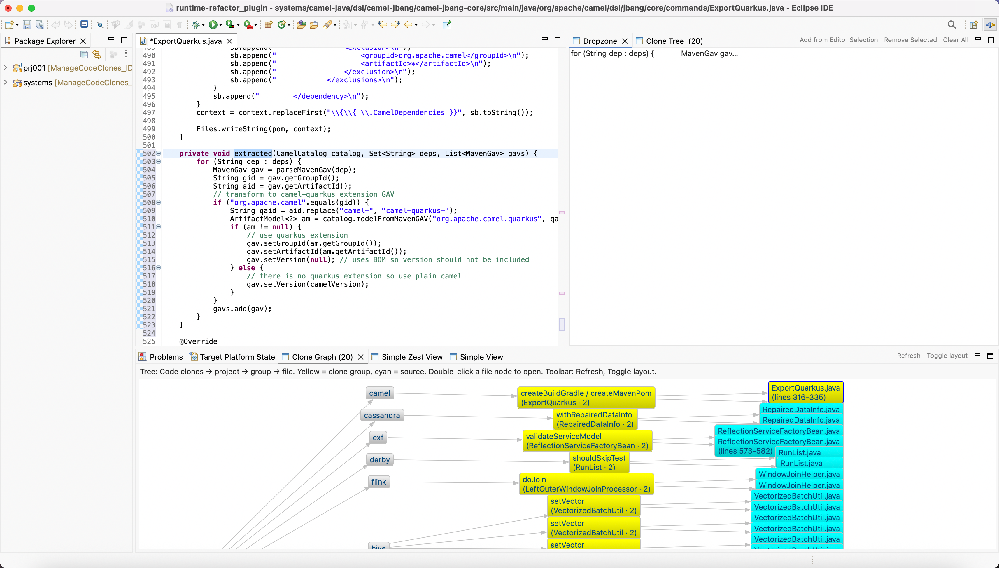

# Refactor Plugin — Clone visualization and extract-method workflow for Eclipse

An Eclipse plug-in (PDE/OSGi) for exploring code-clone results produced offline and applying **pre-computed extract-method refactorings** from a JSON artifact. It complements a **Zest Clone Graph** overview and a **Dropzone** for drag-and-drop driven workflows inside the Java editor.



*Runtime workbench with clone data loaded: graph view and Dropzone alongside the source editor.*

---

## Features

| Capability | Description |
|------------|-------------|
| **Clone Graph** | Zest tree: **Code clones → project → clone group → file**. Toolbar **Load Clone Data…** loads `all_refactor_results.json` (same autoload paths as startup). Color cues (e.g. yellow hub, cyan leaves), default **left-to-right tree** layout; **Refresh** and **Toggle layout** (L→R tree, top-down tree, spring). Double-click a **file** node to open the editor at the range. |
| **Dropzone** | Sidebar list of snippets; drag into an editor. If the target file matches a loaded clone record, the plug-in offers **clone-aware extract method** (all sites updated from JSON). Otherwise it can **wrap** the snippet in a new method (generic path). |
| **Intra-editor drag** | Detects a characteristic move (delete + insert) within the same file; if the file is part of a clone group, can revert the move and apply the pre-computed refactoring (aligned with a VS Code extension workflow). |
| **Automatic JSON load** | On workbench startup, attempts to load `all_refactor_results.json` from the runtime workspace (`systems/` or workspace root) so clone metadata is available before opening the Clone Graph. |

**Note:** Refactoring is triggered from **Dropzone / editor** interactions, not from the graph itself.

---

## Requirements

- **Eclipse** with **PDE** (Plug-in Development Environment) and **Java development** tooling.
- **JavaSE-21** (matches `Bundle-RequiredExecutionEnvironment` in `META-INF/MANIFEST.MF`).
- **GEF Zest**: bundles `org.eclipse.zest.core` and `org.eclipse.zest.layouts` (e.g. *Zest SDK* in the target platform / Eclipse installation).
- **Gson** `2.10.1` is bundled under `lib/` and listed in `build.properties` / `MANIFEST.MF`.

---

## Project layout

```
refactor_plugin/
├── META-INF/MANIFEST.MF      # OSGi bundle, Require-Bundle, classpath (incl. gson jar)
├── build.properties          # Binary build includes (e.g. lib/gson-2.10.1.jar)
├── plugin.xml                # Views, menus, startup hook
├── lib/gson-2.10.1.jar       # JSON parsing
└── src/
    ├── refactor_plugin/      # Core: activator, startup/dnd listener, model, util, dnd transfer
    └── view/                 # CloneGraphView, DropzoneView, Zest samples, handlers
```

Key classes:

- `refactor_plugin.listeners.EditorDropStartup` — early startup: JSON autoload, editor drop targets, intra-editor drag detection.
- `refactor_plugin.util.CloneRefactoring` — applies replacements + single extracted-method insertion using **pristine offsets** and descending application order.
- `refactor_plugin.model.CloneContext` / `CloneRecord` — shared state and JSON shape.
- `view.CloneGraphView` / `DropzoneView` — UI entry points.

---

## Data: `all_refactor_results.json`

- Expects a **JSON array** of clone records (see `CloneRecord.java` for fields such as `classid`, `project`, `sources[]`, `extracted_method`, `updated_files`, line `range`, `replacement_code`, etc.).
- Paths in `sources[].file` are typically **relative to a workspace root** (e.g. `systems/.../Foo.java`). That root is stored in `CloneContext.workspaceRoot` when the JSON is loaded.

**Suggested runtime layout** (Eclipse application workspace):

```
<runtime-workspace>/
├── all_refactor_results.json          # optional
└── systems/
    ├── all_refactor_results.json      # common location
    └── …                              # Java sources matching JSON paths
```

The plug-in resolves the editor’s absolute path against this data so **clone-aware** behavior matches the correct record.

---

## Building and running

1. **Import** this directory as an **Existing Projects into Workspace** (or open it in an Eclipse that already contains the PDE project).
2. Ensure the **target platform** includes the required Eclipse UI, JFace Text, Zest, and `org.eclipse.core.filesystem` bundles (as in `MANIFEST.MF`).
3. **Project → Clean…** the plug-in if you see stale classes or “unable to load class” at runtime.
4. Create or use an **Eclipse Application** launch configuration that includes this plug-in; set the **runtime workspace** to a folder that contains your JSON and `systems` tree (or equivalent paths).
5. In the runtime workbench, open views via **Window → Show View → Other… → Zest Graph Views** (Clone Graph, Dropzone).

---

## Usage summary

1. Load clone data (**Clone Graph** toolbar, or rely on startup autoload if paths match).
2. Explore clones in the **graph**; open files from leaf nodes as needed.
3. Add a snippet to the **Dropzone** from the editor selection, then drag it onto a target editor (or use intra-editor drag where supported) to run **extract method** when a clone record applies.

Use **Undo (Ctrl+Z / Cmd+Z)** in the editor to reverse applied document edits.

---

## Troubleshooting

- **Plug-in fails to load a view class** — Often stale `bin/` output; run **Clean** on `refactor_plugin` and rebuild.
- **Clone-aware path never runs** — Confirm JSON is loaded (`recordMap` non-empty), paths under `systems/` match `sources[].file`, and the editor’s file resolves to the same absolute path (opening from the graph sets `lastOpenedByFile`; autoload + path resolution also support Package Explorer opens).
- **Workspace cannot be locked** — Close other Eclipse instances using the same workspace; remove a stray `.lock` if safe.
- **SVG / SWT capability** — `Require-Capability` for SVG may affect target resolution on some installs; align the target Eclipse with your development environment.

---

## Related

- **Simple View** / **Simple Zest View** — Sample views bundled in the same plug-in for Zest experiments; not required for clone workflows.

---

## Version

Bundle version: **1.0.0.qualifier** (`META-INF/MANIFEST.MF`).
